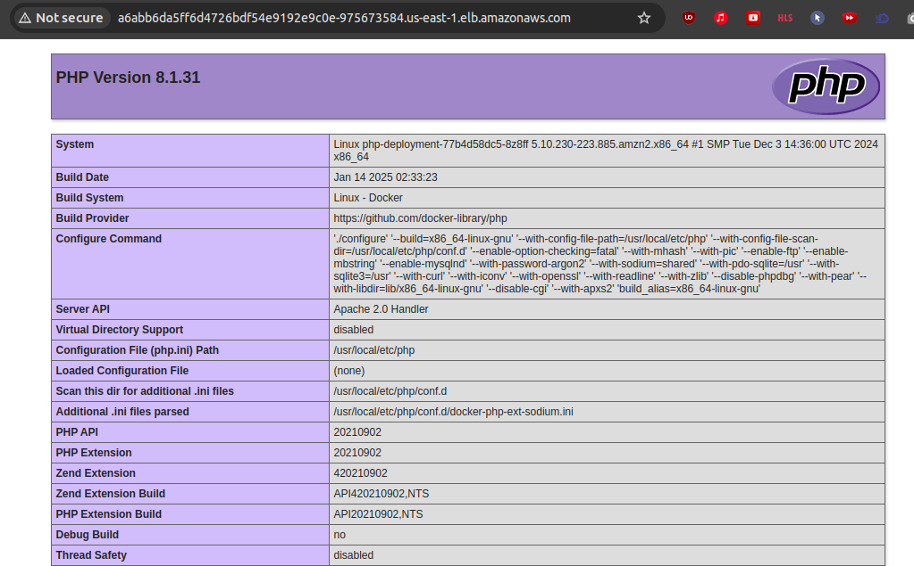

# IBA devops training

## HW20. Deploy php app in AWS EKS, install ingress controller, grant an access for IAM user

Docker image with test PHP page is build on push using gihub actions. Docker image finally published on hub.docker.com as voyager1122/php:latest

used to be deployed in AWS EKS cluster.

[PHP app docker image](https://github.com/voyager1122/iba_php_docker_image)


###  Ingress controller installed using helm chart at Lens


Next step is deploy app in EKS


```bash
sudo kubectl apply -f php-deployment.yaml
sudo kubectl apply -f php-ingress.yaml 
```



###  Grant access for IAM user to AWS EKS cluster

First, need to authenticate to your EKS cluster using kubectl as an admin user.

```bash
kubectl edit -n kube-system configmap/aws-auth
```
Add a new mapping entry for the IAM user under mapUsers. This gives the IAM user the ability to authenticate with the Kubernetes API server.

```bash
kubectl edit -n kube-system configmap/aws-auth
```
Check users ARN in AWS console and add it to mapUsers section:

```yaml
  mapUsers: |
    - userarn: arn:aws:iam::443xxxx8:user/alex_b
      username: alex_b
      groups:
        - system:masters
```		
Result:


```bash
sudo kubectl get configmap -n kube-system aws-auth -o yaml
apiVersion: v1
data:
  mapRoles: |
    - groups:
      - system:bootstrappers
      - system:nodes
      rolearn: arn:aws:iam::4433xxx158:role/ivanf-node-group-1-eks-node-group-202501220xxxx01
      username: system:node:{{EC2PrivateDNSName}}
  mapUsers: |
    - userarn: arn:aws:iam::4433xxx58:user/alex_b
      username: alex_b
      groups:
        - system:masters
kind: ConfigMap
metadata:
  creationTimestamp: "2025-01-22T09:26:34Z"
  name: aws-auth
  namespace: kube-system
  resourceVersion: "54543"
  uid: bfeea0b5-85c3-48c4-b18e-052c4f96be7e

```


```yaml
sudo kubectl -n kube-system describe cm aws-auth
Name:         aws-auth
Namespace:    kube-system
Labels:       <none>
Annotations:  <none>

Data
====
mapRoles:
----
- groups:
  - system:bootstrappers
  - system:nodes
  rolearn: arn:aws:iam::443xxx158:role/ivanf-node-group-1-eks-node-group-202501xxxxx01
  username: system:node:{{EC2PrivateDNSName}}

mapUsers:
----
- userarn: arn:aws:iam::443xxx58:user/alex_b
  username: alex_b
  groups:
    - system:masters


BinaryData
====

Events:  <none>
```

Finally need to configure kubectl to interact with the cluster. 
Assuming that the user has the AWS CLI installed and configured with the correct IAM credentials, they can run the following command:

```bash
sudo aws eks --region us-east-1 update-kubeconfig     --name ivanf-eks-training
```
